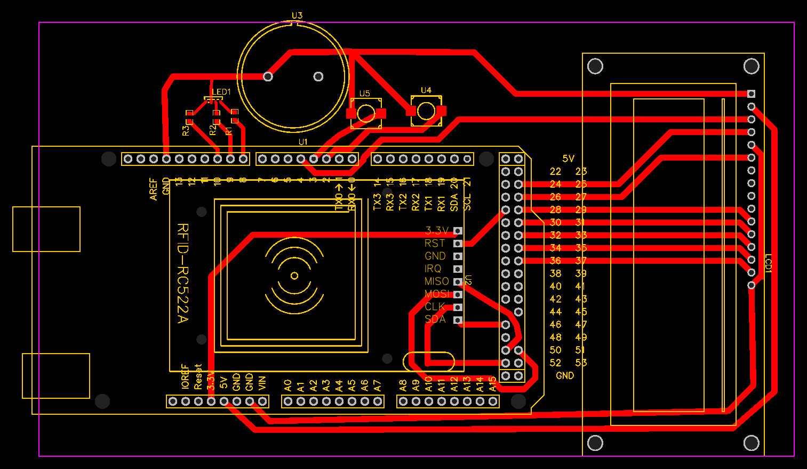

# Arduino RFID Reader Project
This repository contains code for an RIFD Reader using Arduino, the Arduino sketch, and a tool to edit the SQL Database created for the RFID Reader

# RFID Reader
The Purpose of the reader is to track traffic in the classroom. 
Requires an Arduino with an RC522 RFID Sensor and 2 buttons. 
Once running, the program waits for the Arduino to detect a card or a tag being scanned. 
After scanning a tag, the program will wait for a button top be pressed, to specify if you're either entering or leaving. If no button is pressed, the program will return to waiting for a scan. 
The Arduino is setup with a LCD screen, to give instructions to the user (Read Card, Press button, etc..), and to show if there is an error (Card not in database, trying to enter when already in, etc...) 

# RFID Manager
This tool was made to make managing the database easier, and without needing to access the phpmyadmin site. 
This tool can:  

- Show all tags/cards in the database, their ID, and associated name if they have one 

- Add a new name to an existing tag in the database 

- Remove a name from an existing tag with a name already assigned to it 

- Add a new tag or card into the database 

- Read succesful scans 

- Read the error log 

- Read the action log (Every action done from the RFID Manager) 

- Log out everyone currently logged in through the scanner for debugging purposes 

This tool does not require an Arduino with an RC522 RFID Sensor for anything other than adding new cards or tags into the database 

To use the tool, launch it from command prompt with the command "python rfidmanager.py", or use the executable. 

# SQL Database
The SQL Database is set in a way where all the tags/cards that the reader accepts, are in a table named "tags", while the names associated with each tag are in a table called "nicknames" 
"Access log" stores the information of every succesful log in/out 
"Action log" stores every action made by the rfidmanager 
"Error log" logs possible errors from the manager and reader (Tag not in database, etc..) 

# Arduino

This project was made using an Arduino Mega 2560 Rev3 / JOY-iT MEGA 2560 and the following parts: 
1x RGB LED light 
2x Button 
1x Arduino Piezo 
1x RFID-RFC522 module 
1x 16x2 LCD Screen 
## 16x2 LCD Screen
The LCD Screen is set in a way where you can change the wanted contrast using the Arduino Sketch, instead of a potentiometer 
## 16x2 LCD Screen Pins
VSS to GND 
VDD to 5V 
V0 to Digital pin 4 
RS to Digital Pin 25 
RW to GND  
E to Digital Pin 27  
 
D4 to Digital Pin 29 
D5 to Digital Pin 31  
D6 to Digital Pin 33  
D7 to Digital Pin 35  
A to Digital Pin 37  
K to GND  

## RFID-RFC522 Module Pins
SDA to Digital Pin 46 
SCK to Digital Pin 52 
MOSI to Digital Pin 51 
MISO to Digital Pin 50 
RST to Digital Pin 49 

## Other Pins
In Button to Digital Pin 2 
Out Button to Digital Pin 3 
Piezo to Digital Pin 7

## RGB LED Pins
R to Digital Pin 10 
B to Digital Pin 9 
G to Digital Pin 8 

# Usage
## Reader

Download and use the Arduino IDE to upload the included sketch onto your Arduino, if using different pin locations make sure to change them in the Arduino sketch  

Set up your Database tables as shown earlier, if you change the names of anything, make sure you change them in BOTH rfidmanager.py and rfidreader.py  

Setup the correct mysql connection parameters in both rfidmanager.py and rfidreader.py  

Connect your Arduino with the sketch uploaded to the machine you want to run the scanner, and launch rfidreader.py  

## Manager

Launch the rfidmanager.py script either by using the console (python rfidmanager.py) or by using the executable included 

If adding new tags to the database, you need an Arduino running the RFID Reader sketch attached to the computer running the rfidmanager.py, otherwise it is not necessary. 

# RFID-lukija
Lukijan tarkoitus on seurata luokan liikennettä. 
Tarvitset Arduinon, jossa on RC522 RFID-anturi ja 2 painiketta. 
Kun ohjelma on käynnissä, se odottaa, että Arduino havaitsee kortin tai lätkän skannauksen.  
Skannauksen jälkeen ohjelma odottaa, että painiketta painetaan, jotta voidaan määrittää, oletko saapumassa vai lähtemässä. Jos painiketta ei paineta, ohjelma palaa odottamaan skannausta.  
Arduino on varustettu LCD-näytöllä, joka antaa käyttäjälle ohjeita (Lue kortti, Paina nappia, jne.) ja näyttää virhetilanteet (Kortti ei tietokannassa, yrität kirjautua sisään vaikka olet jo sisällä jne.). 

# RFID-hallintatyökalu
Tämä työkalu on tehty helpottamaan tietokannan hallintaa ilman, että tarvitsee käyttää phpMyAdmin-sivustoa.  
Työkalu voi:  
- Näyttää kaikki tietokannan kortit/lätkät, niiden ID:n ja niihin liitetyt nimet, jos niitä on. 

- Lisätä uuden nimen olemassa olevaan tietokannan korttiin/lätkään. 

- Poistaa nimen olemassa olevasta tunnisteesta, johon on jo liitetty nimi. 

- Lisätä uuden tunnisteen tai kortin tietokantaan. 

- Lukea onnistuneet skannaukset. 

- Lukea virhelokin. 

- Lukea toimintalokin (kaikki RFID-hallintatyökalulla tehdyt toimet). 

- Kirjata ulos kaikki, jotka ovat kirjautuneena lukijan kautta. 

Tämä työkalu ei vaadi Arduinoa tai RC522 RFID-anturia mihinkään muuhun kuin uusien korttien tai tunnisteiden lisäämiseen tietokantaan. 

Käyttääksesi työkalua, käynnistä se komentokehotteesta komennolla "python rfidmanager.py" tai käytä suoritettavaa tiedostoa. 

# SQL-tietokanta
SQL-tietokanta on luotu siten, että kaikki lukijan hyväksymät tunnisteet/kortit ovat taulukossa nimeltä "tags", kun taas kuhunkin lätkään liitetyt nimet ovat taulukossa nimeltä "nicknames".  
"Access log" tallentaa jokaisen onnistuneen sisään- ja uloskirjautumisen tiedot.  
"Action log" tallentaa jokaisen RFID-hallintatyökalulla tehdyn toimen.  
"Error log" kirjaa mahdolliset virheet lukijasta ja hallintatyökalusta (Lätkä ei löydy tietokannasta, jne.). 

# Arduino
Tämä projekti tehtiin käyttämällä Arduino Mega 2560 Rev3 / JOY-iT MEGA 2560 -alustaa ja seuraavia osia:  
1x RGB LED-valo  
2x Painike  
1x Arduino Piezo  
1x RFID-RFC522-moduuli  
1x 16x2 LCD-näyttö 

## 16x2 LCD-näyttö
LCD-näyttö on asetettu siten, että haluttu kontrasti voidaan muuttaa Arduino-sketchin avulla koodista, potentiometrin sijasta. 

